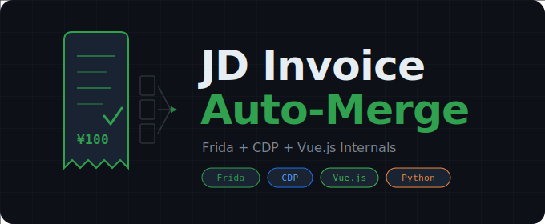

<div align="center">



<br/>
<br/>

**京东发票自动换开/合开工具**

*基于 Frida 动态注入 + Chrome DevTools Protocol 操控 App 内 WebView*

[](LICENSE)
[](https://www.python.org/)
[](https://frida.re/)
[]()

</div>

---

## 概述

`jd-invoice-merge` 不是简单的爬虫或模拟点击工具。它通过 **Frida 动态注入** 开启京东 App 自研 D6 Chromium WebView 的调试端口，再经由 **Chrome DevTools Protocol (CDP)** 直接操控页面内的 **Vue.js 组件实例**，绕过 native bridge 认证限制，实现全自动的发票合并换开。

> **仅供技术学习与研究。** 请遵守京东平台服务条款及相关法律法规。

### 功能特性

- **数据采集** -- 自动翻页加载发票中心全部订单，支持换开 tab 和全部 tab 两种模式
- **智能规划** -- 按开票机构 (orgId) 分组，贪心搜索最优组合，每张发票 >= ¥100 且尽量紧凑
- **批量执行** -- 逐张提交合开请求，随机延迟 + 失败重试 + 断点续传
- **单独换开** -- 对不在合开列表中的大额订单，通过 `goodsCard.jumpToHk()` 自动单独换开

---

## 技术架构

```
                    ┌──────────────────────────────────────┐
                    │           Python 脚本层               │
                    │                                      │
                    │  fetch_orders  optimize  batch_merge  │
                    │       │            │          │       │
                    │  ┌────▼────────────▼──────────▼────┐  │
                    │  │         core/ 公共模块           │  │
                    │  │  bridge  cdp  connection config │  │
                    │  └──────┬────────────┬────────────┘  │
                    └─────────┼────────────┼───────────────┘
                              │            │
                     ┌────────▼──┐  ┌──────▼───────────────┐
                     │  Frida    │  │  CDP WebSocket       │
                     │  17.x    │  │  Runtime.evaluate()   │
                     └────┬─────┘  └──────┬────────────────┘
                          │               │
              ┌───────────▼───────────────▼────────────────┐
              │                                            │
              │   京东 App  (com.jingdong.app.mall)         │
              │   ┌──────────────────────────────────┐     │
              │   │  D6 Chromium WebView             │     │
              │   │  ┌────────────────────────────┐  │     │
              │   │  │  Vue.js 发票中心页面        │  │     │
              │   │  │                            │  │     │
              │   │  │  OrderList                 │  │     │
              │   │  │  ├── InfiniteScroll        │  │     │
              │   │  │  ├── goodsCard[]           │  │     │
              │   │  │  └── HksAppIvcTitle (表单)  │  │     │
              │   │  └────────────────────────────┘  │     │
              │   └──────────────────────────────────┘     │
              └────────────────────────────────────────────┘
```

### 为什么不能直接 HTTP 发包？

京东发票中心的 API 认证走 **native bridge**，而非标准 cookie/token：

```
页面 JS  -->  JD SDK (JDBridge)  -->  原生 App 网络层  -->  注入认证头  -->  HTTP 请求
```

Python 直接发 HTTP 请求缺少原生层注入的认证信息，服务端返回 **401**。本工具的解法：通过 CDP 在页面上下文中执行 JS，借助页面自身的 SDK 完成认证。

---

## 项目结构

```
jd-invoice-merge/
│
├── core/                        # 公共模块
│   ├── bridge.py                # Frida 17.x Java bridge 加载 + D6 WebView 调试
│   ├── cdp.py                   # CDP WebSocket 通信、JS 执行、端口转发
│   ├── connection.py            # Frida + CDP 生命周期管理 (async context manager)
│   └── config.py                # 配置文件加载与默认值合并
│
├── scripts/                     # 功能脚本
│   ├── fetch_orders.py          # 采集订单数据 (换开 tab + 全部 tab)
│   ├── optimize.py              # 最优合开组合算法
│   ├── batch_merge.py           # 批量合开执行 (含重试、断点续传)
│   └── batch_single_hk.py      # 批量单独换开 (全部 tab 大额订单)
│
├── data/                        # 运行时数据 (已 gitignore)
├── config.example.json          # 配置文件模板
├── requirements.txt             # Python 依赖
└── LICENSE
```

---

## 环境准备

### Frida 是什么？

[Frida](https://frida.re/) 是一个动态二进制插桩框架，可以在运行时向 App 进程注入 JavaScript 代码。本项目用它来开启京东 App 内 WebView 的调试开关（该开关在正式版中是关闭的）。

整个链路是这样的：

```
你的电脑                              手机 (已 root)
┌─────────────┐    USB/ADB     ┌──────────────────────────┐
│  Python     │ ◄────────────► │  frida-server (后台运行)   │
│  + frida    │                │       │                   │
│             │                │       ▼                   │
│  脚本运行    │                │  注入 JS 到京东 App 进程    │
│             │                │       │                   │
│             │                │       ▼                   │
│             │   CDP/WS       │  开启 D6 WebView 调试端口  │
│             │ ◄────────────► │       │                   │
│             │                │       ▼                   │
│  操控 Vue   │                │  发票中心 H5 页面           │
│  组件实例    │                │  (Vue.js)                 │
└─────────────┘                └──────────────────────────┘
```

### 安装 Frida（详细步骤）

**1. 电脑端安装 Python 包：**

```bash
pip install frida frida-tools
```

安装完成后确认版本：

```bash
frida --version
# 输出类似: 17.0.5
```

**2. 手机端安装 frida-server：**

到 [Frida Releases](https://github.com/frida/frida/releases) 下载与你 **Python frida 包版本一致** 的 frida-server。

> 版本必须完全匹配！比如电脑端 `frida==17.0.5`，手机端就要下载 `frida-server-17.0.5-android-arm64.xz`。

```bash
# 查看手机架构
adb shell getprop ro.product.cpu.abi
# 常见输出: arm64-v8a

# 解压并推送到手机
xz -d frida-server-17.0.5-android-arm64.xz
adb push frida-server-17.0.5-android-arm64 /data/local/tmp/frida-server
adb shell "chmod 755 /data/local/tmp/frida-server"
```

**3. 启动 frida-server：**

```bash
adb shell "su -c /data/local/tmp/frida-server &"
```

**4. 验证连接：**

```bash
frida-ps -U | grep jingdong
# 应该能看到: com.jingdong.app.mall
```

> 如果 `frida-ps -U` 报错 "unable to connect to remote frida-server"，检查：手机是否已 root、frida-server 是否在运行、版本是否匹配。

### 其他环境要求

| 要求 | 说明 |
|:---|:---|
| Python | >= 3.10 |
| 手机 | 已 root，USB 调试已开启 |
| ADB | 已连接手机（`adb devices` 能看到设备） |
| 京东 App | 已登录，已打开发票中心页面 |

### 安装本项目

```bash
git clone https://github.com/yourname/jd-invoice-merge.git
cd jd-invoice-merge
pip install -r requirements.txt
```

---

## 配置

```bash
cp config.example.json config.json
```

编辑 `config.json`，填入你的发票抬头信息：

```json
{
  "invoice": {
    "ivc_title": "你的姓名",
    "ivc_title_type": 4,
    "ivc_type": 3,
    "ivc_content": 1,
    "change_reason": "抬头有误"
  }
}
```

<details>
<summary><b>完整配置参考</b></summary>

| 字段 | 默认值 | 说明 |
|:---|:---|:---|
| `invoice.ivc_title` | `""` | 发票抬头（你的姓名或公司名） |
| `invoice.ivc_title_type` | `4` | 4 = 个人，2 = 企业 |
| `invoice.ivc_type` | `3` | 3 = 电子普通发票 |
| `invoice.ivc_content` | `1` | 1 = 商品明细 |
| `invoice.change_reason` | `"抬头有误"` | 换开原因 |
| `merge.target_amount` | `100.0` | 每张合开发票的最低金额 |
| `merge.max_orders_per_invoice` | `10` | 单张发票最多合并的订单数 |
| `execution.delay_min` / `delay_max` | `4` / `9` | 每张发票间的随机延迟（秒） |
| `execution.retry_limit` | `2` | 失败重试次数 |

</details>

---

## 使用方法

**第 1 步** -- 确保 frida-server 在手机上运行（参见上方安装步骤）

**第 2 步** -- 打开京东 App -> 我的 -> 客户服务 -> 发票服务

**第 3 步** -- 采集订单数据：

```bash
python -m scripts.fetch_orders
```

**第 4 步** -- 生成最优合开计划：

```bash
python -m scripts.optimize
```

<details>
<summary>输出示例</summary>

```
MERGE PLAN: N invoices, M orders, ¥xxxx.xx
Avg waste per invoice: ¥x.xx

Invoice 1: orgId=544 | 3 orders | ¥100.07 (waste ¥0.07)
    xxxxxxxxxx  ¥49.90
    xxxxxxxxxx  ¥29.90
    xxxxxxxxxx  ¥20.27
...
```

</details>

**第 5 步** -- 批量执行合开：

```bash
python -m scripts.batch_merge
```

**第 6 步** *(可选)* -- 对大额订单单独换开：

```bash
python -m scripts.batch_single_hk
```

---

## 合开算法

### 问题定义

给定同一 `orgId`（开票机构）下的 *N* 个订单，每个订单金额为 *a_i*，将它们划分为 **尽可能多的子集**，使每个子集的金额之和 >= ¥100。

### 算法思路

```
对每个 orgId 分组:
    pool = 按金额降序排列的订单
    while sum(pool) >= 目标金额:
        for size in [2, 3, ..., max_size]:
            在 pool 中找 size 个订单的组合，使 sum 最接近目标金额（且 >= 目标）
            if 找到且 sum < 目标 * 1.10:
                break  // 足够紧凑，不再搜索更大 size
        记录该组合为一张发票
        从 pool 中移除已用订单
```

**剪枝策略：**
- **Top-k 检查**：如果最大的 k 个订单之和 < 目标金额，跳过 size=k
- **Bottom-k 检查**：如果最小的 k 个订单之和 >= 当前最优解，跳过 size=k
- **提前终止**：找到的组合金额在目标的 110% 以内，不再搜索更大组合

---

## 技术细节

### Frida 17.x Java Bridge 问题

Frida 从 17.x 版本开始，将 Java bridge 从核心运行时中解耦。这意味着直接在注入脚本中调用 `Java.perform()` 会抛出：

```
ReferenceError: Java is not defined
```

**原因**：Frida 17.x 不再自动加载 Java bridge，需要手动引入。

**本项目的解决方案**（见 [`core/bridge.py`](core/bridge.py)）：

```python
# 1. 找到 frida-tools 自带的 Java bridge 文件
bridge_path = os.path.join(
    os.path.dirname(frida_tools.__file__), 'bridges', 'java.js'
)

# 2. 读取 bridge 代码，将 bridge 对象绑定到 globalThis.Java
bridge_code += "Object.defineProperty(globalThis, 'Java', { value: bridge });"

# 3. 将 bridge 代码和用户脚本打包成 Frida 可执行的格式
#    格式: 📦\n{size} /frida/repl-{n}.js\n✄\n{code}
```

打包后的脚本通过 `session.create_script()` 加载，Java bridge 就可以正常使用了。

### D6 Chromium WebView

京东 App 使用自研 **D6 Chromium** 内核（`libd6webviewchromium.so`），不是标准 Android WebView。关键区别：

| 对比项 | 标准 Android WebView | 京东 D6 Chromium |
|:---|:---|:---|
| 调试开关 | `WebView.setWebContentsDebuggingEnabled()` | `XWebView.enableWebContentsDebug()` |
| DevTools Socket | `webview_devtools_remote_{pid}` | `dong_webview_devtools_remote_{pid}` |
| 引擎 | 系统 Chromium | 内置 D6 Chromium |

通过 Frida 找到 `XWebView` 实例并调用 `enableWebContentsDebug(true)` 后，就可以用标准 CDP 协议连接了：

```bash
# ADB 端口转发
adb forward tcp:9444 localabstract:dong_webview_devtools_remote_{pid}

# 查看可调试页面
curl http://localhost:9444/json
```

### Vue 组件直接操控

发票中心页面基于 Vue.js。通过 `element.__vue__` 访问组件实例，直接调用内部方法：

```javascript
// 触发分页加载（走 native bridge 认证，绕过 401 问题）
infiniteScroll.$emit('load')

// 注入订单数据并提交合开请求
vm.commitBatchHkfpReq(orders)

// 服务端校验通过后，确认合并
vm.submitMerge()
```

这比 DOM 模拟点击更可靠 -- 不依赖 CSS 选择器、不受页面布局变化影响。

---

## 免责声明

本项目仅供技术学习和研究目的。使用者应自行承担使用风险，遵守京东平台的服务条款和相关法律法规。作者不对因使用本工具造成的任何后果负责。

---

<div align="center">

基于 [Frida](https://frida.re/) + [Chrome DevTools Protocol](https://chromedevtools.github.io/devtools-protocol/) + [Vue.js](https://vuejs.org/) 内部机制构建

</div>
